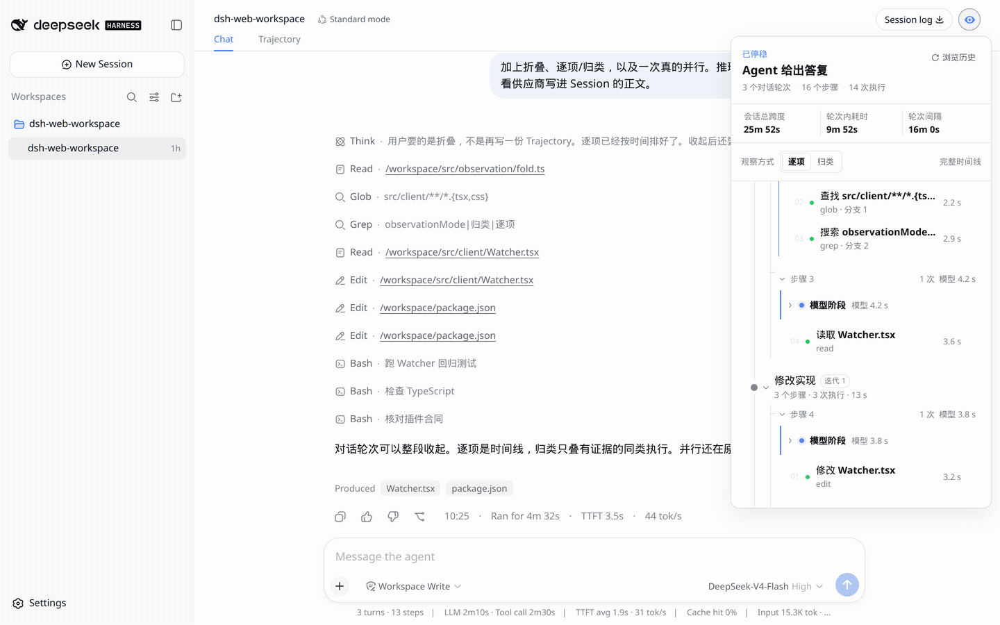
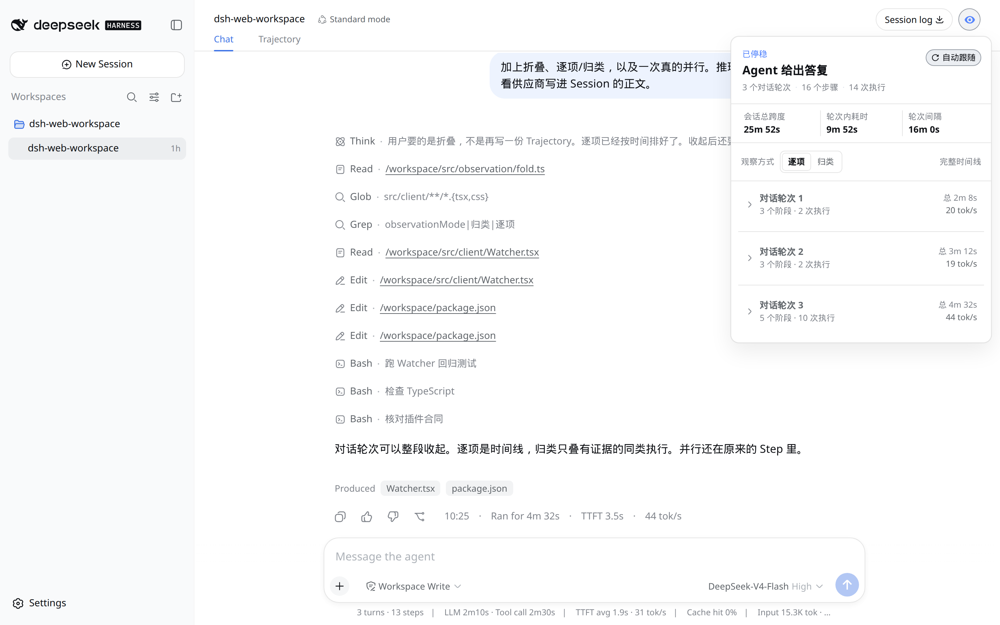
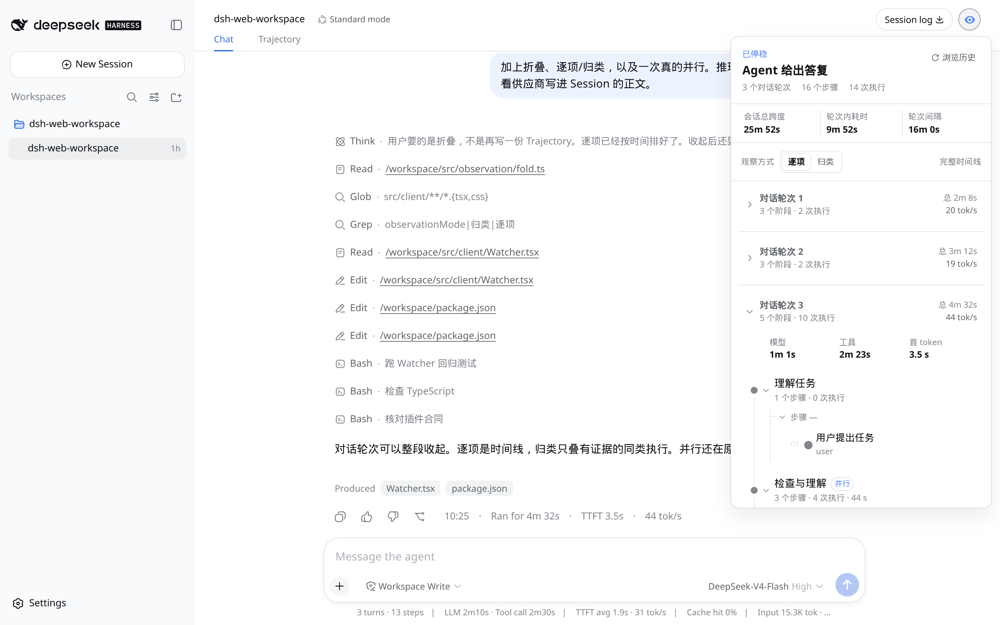

[中文](./README.md) · English

# Watcher

## Install

### DSH Studio desktop app (recommended)

Open **Settings → Plugins → Add plugin** and enter this in “Package name or address”:

```text
github:daha1216/dsh-watcher#v0.6.2
```

The desktop plugin manager owns the Desktop profile and bundled package manager. This release commits `lib/`; normal use needs no clone, build, or DSHX installation. Follow the app if it asks you to reload or reopen after installation.

### Web CLI

```sh
dsh plugin --profile web add github:daha1216/dsh-watcher#v0.6.2
```

This official CLI command writes only the `web` profile; it cannot modify the Desktop App profile. For an already-running Web Host, reopen that Host once and reload the page.

DeepSeek Harness **0.1.7-rc.2** (`@deepseek-ai/dsh@0.1.7-rc.2`). The peer range `>=0.1.7-rc.1 <0.1.8` also accepts **0.1.7-rc.1**. Node `^22.19.0` or `>=24`.

A read-only plugin for DeepSeek Harness Web. Open the eye in the session header. A Session becomes a foldable work path: how many steps ran, how many tools fired, how long it took. Open a step for parallel branches, a tool result, or a reasoning row that stays folded until you ask.

It does not inject messages, invent hidden chain-of-thought, or replace the official Trajectory.








Grouped view only stacks what it can prove. Two different bash calls stay apart. The model stage shows only provider-visible reasoning already written into the Session. If nothing was recorded, it says so.

From a clone (development/local testing):

```sh
git clone https://github.com/daha1216/dsh-watcher.git
dsh plugin --profile web add ./dsh-watcher
```

That path also needs pnpm, then reopen that Web Host and reload the page.

```sh
dsh plugin --profile web remove dsh-watcher
```

The public CLI manages `web` only; use the in-app “Add plugin” entry above for the Desktop App.

The settings summary and session HUD show **Estimated cost** (not “total value”) next to total tokens. Input / output / cache buckets are priced from `pricing/models.yaml`. A missing row is **Unknown**, never $0. A partial estimate keeps the known dollar in the main number and footnotes **Some models unpriced**. It is an estimate, not a bill. The default table covers mainstream DeepSeek, MiniMax, OpenAI, Anthropic, Gemini, Grok, GLM, and Qwen rows and is static (no live fetch). Override it in Watcher settings (`localStorage` key `dsh-watcher:pricing-override:v1`). PRs to the default table are welcome.

The interaction contract lives in [DESIGN.md](./DESIGN.md). MIT.

## What's new in 0.6.1

- Checked on official DeepSeek Harness **0.1.7-rc.2**. `@deepseek-ai/dsh-*` peers stay `>=0.1.7-rc.1 <0.1.8`, so install accepts `0.1.7-rc.1` and `0.1.7-rc.2` and rejects `0.1.7-alpha.*`.
- Icons stay `IconChevronRightOutlineRegular`, `IconRefreshOutlineRegular`, `IconCheckOutlineRegular`, and `IconCopyOutlineRegular`. rc.2 still does not export the size-suffixed names.

## 0.6.0

- Targets official DeepSeek Harness **0.1.7-rc.1**. `@deepseek-ai/dsh-*` peers are `>=0.1.7-rc.1 <0.1.8`, so install accepts `0.1.7-rc.1` and rejects `0.1.7-alpha.*`.
- Icons are `IconChevronRightOutlineRegular`, `IconRefreshOutlineRegular`, `IconCheckOutlineRegular`, and `IconCopyOutlineRegular`. rc.1 removed the size-suffixed exports and ships no aliases.

## 0.5.0

- **The panel resizes.** Drag the right edge, the bottom edge, or the corner grip; the frame stays put while it grows, and it can never shrink below the size it opened at.
- **The HUD folds to one line.** A `▾` next to the scope switch collapses the timing panel to just the top bar, and the choice is remembered.
- **"定位现场" lands on the actual failure.** It now selects the exact failing step and opens the inspector on it instead of scrolling to a bare turn header.
- **Repeated failures no longer stack.** One failure chain updates one card, and the title names its turn (`第 N 轮`).

Plus the 0.4.5 fixes: the inspector back control no longer re-arms follow, the first range pick no longer rescans sessions, the projection state no longer stores a copy of its own view, and the timing panel's non-terminal slice is labelled correctly.

Older releases: [CHANGELOG.md](./CHANGELOG.md).

## Build from source

Skip this for a normal install. Rebuild the committed `lib/` with **pnpm** after TypeScript changes:

```sh
pnpm install
pnpm test
node scripts/link-harness-dependencies.mjs /path/to/harness
pnpm build
```

`pnpm build` needs a local Harness checkout that can resolve the `@deepseek-ai/dsh-*` peers. Do not use this path to install the plugin.

Watcher waits for the Chat projection on cold sessions before mounting its panel.
